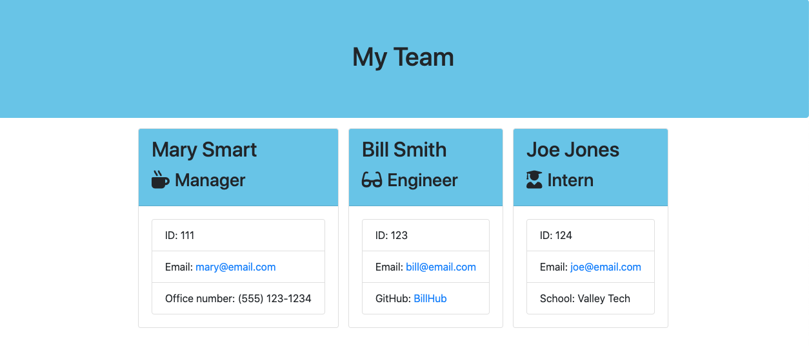

<h1>Template Engine Employee Summary</h1>
<h2>John Manouse</h2>

I created a  node command line interface(CLI) that will prompt you in the terminal, for an employee's information, in order to create an employee team. The user will input information in the terminal following the prompts. This will create a team, and will write the information to an HTML file. The link below will provide you with a short video on how the application works.

 XXX

 

<h2>Template Engine Employee Summary</h2>
<ul>
    <li>HTML code</li>
    <li>CSS</li>
    <li>Javascript</li>
    <li>jQuery</li>
    <li>node.js</li>
</ul>

<h2>Pull Requests welcome for contribution</h2>

John Manouse

Video Link: <a href="https://drive.google.com/file/d/1AIbv01V5c02P1zaa-6Nfk_s0WxA5L4ol/view">Template Engine Employee Summary Video</a>

Github: <a href="https://github.com/Mirageg4/Template_Engine-Employee_Summary/.">Template_Engine-Employee_Summary Repo</a>

              

License: Project is licensed under the MIT License. 
See <a href ="LICENSE.md">LICENSE</a> file for details.

